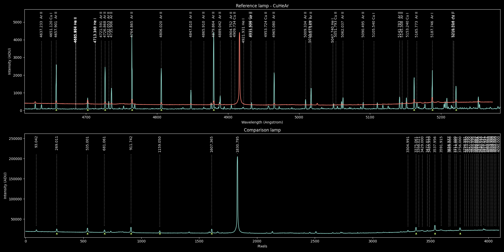

.. _create_reference_lamps:

Create Reference Lamps
######################

As a secondary tool now the goodman pipeline package includes a new shell script
``redspec-create-reference-lamp`` that helps to create reference lamps using an
interactive plot.

Process Overview
****************
First of all, a *reference lamp* is the spectrum of a lamp that contains known spectral lines and
it has a wavelength solution, so those lines are actually identified and the entire spectral axis
is well defined.

The ``goodman-pipeline`` package uses reference lamps as templates to solve other lamps in the same
instrument configuration or *mode*.

.. important::

    We call *reference lamps* the lamps that can be used to calibrate other lamps and
    *comparison lamp* just any lamp, specially those without wavelength calibration.

So, what ``redspec-create-reference-lamp`` does is to help in the creation of a properly formatted
reference lamp, starting from a comparison lamp and a reference lamp. Once the process has ended you
will have a new reference lamp.

The comparison lamp must be a 1D spectrum, ideally extracted using the goodman pipeline package
since it will contain important metadata for traceability. If those keywords are not present they
will be added but with empty or default values.

First the script will try to find a matching reference lamp from the package's library of reference
lamps, if there is no direct match it will display a list of lamps that *could* be compatible and
gives the command to use.

The user could select any other reference lamp right away.

Then, the user must find the matching pattern and identify each line on either side and when the
scripts detects the right amount of data points it will calculate the wavelength solution and
overplot the wavelength calibrated comparison lamp over the reference lamp. This helps to
corroborate and find more matches.

Once the user is satisfied can save the newly calibrated reference lamp.

.. important::

    The newly calibrated reference lamp will be saved in the same folder of its parent file. i.e.
    the same folder as the comparison lamp.

Reference Lamp Selection
************************

As it was said before, the goodman pipeline comes with a library of reference lamps and with tools
to sort them out. All goodman comparison lamps come with a set of keywords that contain the
information of all the lamps status, for instance, a copper lamp should have the following section
in its header:

.. code-block::

    LAMP_HGA= 'FALSE'              / Hg(Ar)
    LAMP_NE = 'FALSE'              / Neon
    LAMP_AR = 'FALSE'              / Argon
    LAMP_FE = 'FALSE'              / Iron
    LAMP_CU = 'TRUE'               / Copper
    LAMP_QUA= 'FALSE'              / Quartz
    LAMP_QPE=             0.000000 / Quartz Percent
    LAMP_BUL= 'FALSE'              / Bulb
    LAMP_DOM= 'FALSE'              / Dome
    LAMP_DPE=             0.000000 / Dome Percent

This indicates that the cooper lamp was on.

.. note::

    The copper lamp actually contains Copper, Helium and Argon (CuHeAr).
    The same for Iron, it contains Iron, Helium and Argon (FeHeAr)

So, in order to select the best lamp, the script will first try to find an exact match of the lamp
keywords. More precisely, ``LAMP_HGA``, ``LAMP_NE``, ``LAMP_AR``, ``LAMP_FE`` and ``LAMP_CU``.

Then, it will filter out all the reference lamps that do not contain the theoretical central
wavelength for the comparison lamps. If there are more than one lamps that pass this test it will
estimate the wavelength range for each reference lamp and for the comparison lamp and will select
the one with with the most similar range to the comparison lamp's.

Controls & Commands
*******************

The window is a matplotlib's pyplot plot and makes use of its interactive capabilities.

For selecting a line press :kbd:`Control` + Click. Then a smaller plot will pop up, use :kbd:`Left` and
:kbd:`Right` arrow to adjust the selection to the best apparent line center. Press :kbd:`Enter` to confirm
your selection and :kbd:`Escape` to cancel.

For the reference lamp, if there is a NIST line nearby you can match it to the closest one using
the :kbd:`m` key.

.. note::

    Always rely on the help provided interactively. :kbd:`h` will print a contextual help.

To save the resulting reference lamp use :kbd:`w`.

Mathematical Model
******************

The only supported model is ``Chebyshev`` of order 3.

From experience, this is usually the best model for Goodman HTS's spectra.
